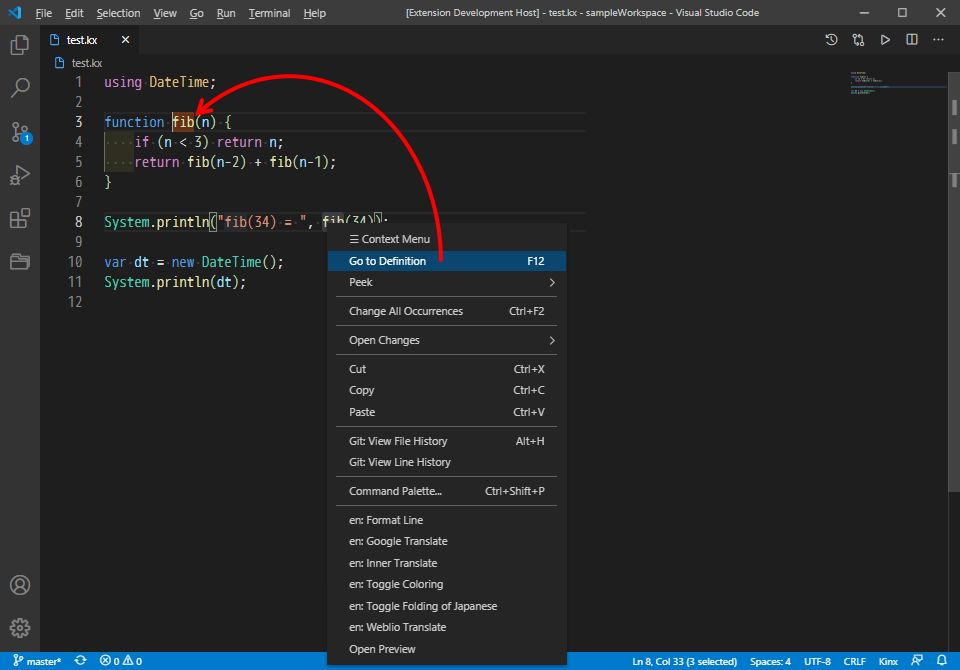

# Kinx VSCode Extension

The Kinx VSCode Extension with Language Server.

# Getting Started

> **Important**
> This extension requires the Kinx version 0.20.1 or above is installed.

Now this product is under construction. It works with a debug mode only.

1. Install Kinx.
2. Add the path of Kinx to the PATH environment variable.
3. Run VSCode under `kinx-language-server` directory.
4. Press <kbd>F5</kbd> key to run it with a debug mode.
5. Load your Kinx source code.

# Features

* Code Highlight
* Problem Detection
  * Detects erros and warnings.
* Run Script
  * Run the current script file on the VSCode.
  * Run the script only with the range of selection.
* Go to Definition
* Auto completion

## Code Highlight

Your source code will be displayed with a highlight.
It will be suited with your theme color.

## Problem Detection

### Error

Compile Error will be detected as an error.
You can find and fix it easily.

### Warning

Warning is not an error, but you can check it easily.
Currently only the following warning is supported.

* Unused Variables

## Run Script

You can run your script code on the fly even without saving.
It is easy because of clicking an icon or just pressing a <kbd>Ctrl-R</kbd> key.

There are 4 modes to run the script.

1. Press <kbd>Ctrl-R</kbd> to run the whole script.
2. Press <kbd>Ctrl-Shift-R</kbd> to run the selected text only.
3. Press <kbd>Ctrl-E</kbd> and input arguments, and press Enter to run the whole script.
4. Press <kbd>Ctrl-Shift-E</kbd> and input arguments, and press Enter to run the selected text only.

## Go to Definition

Right click on a symbol and select `Go to Definition`, and a cursor will jump to the location where the symbol you selected is defined.
Even if the definition is in another file, the source code will be automatically opened and jump to the location.

## Auto Completion

Auto completion is available.
It suggests public methods collected from the class automatically, and it will also include methods on a base class.

# License

This project is licensed under the **MIT License**.
See the [LICENSE](LICENSE) file for details.

