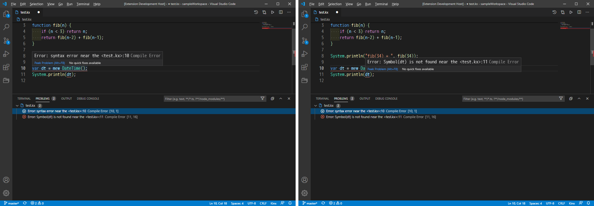
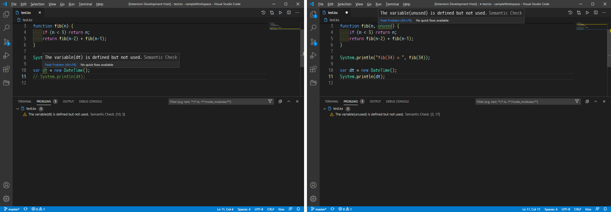
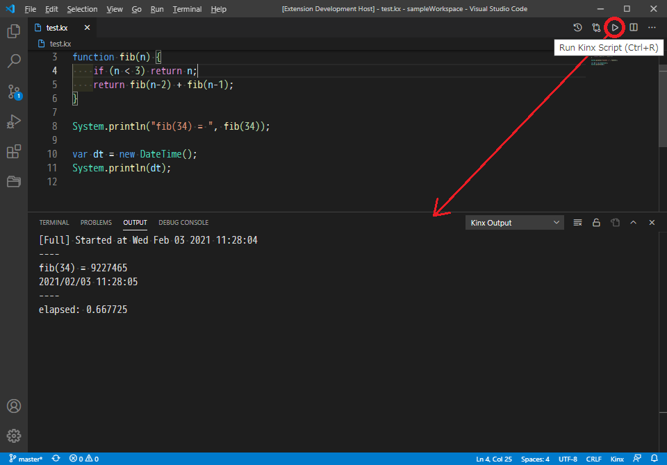

# kinx-language-server

The Kinx Language Server for VSCode.

# Getting Started

Now this product is under construction. It works with a debug mode only.

1. Install Kinx.
2. Add the path of Kinx to the PATH environment variable.
3. Run VSCode under `kinx-language-server` directory.
4. Press `[F5]` key to run it with a debug mode.
5. Load your Kinx source code.

# Features

* Detects a script error.
* Detects an unused variable though it is defined.
* Auto-completion.
* Run the current script file on the VSCode.

## Error

* Compile Error will be detected as an error.

## Warning

* Unused variables are detected as a warning.

## Run Script

* Run your script code there.

