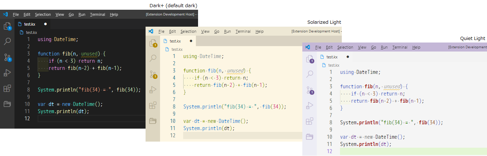
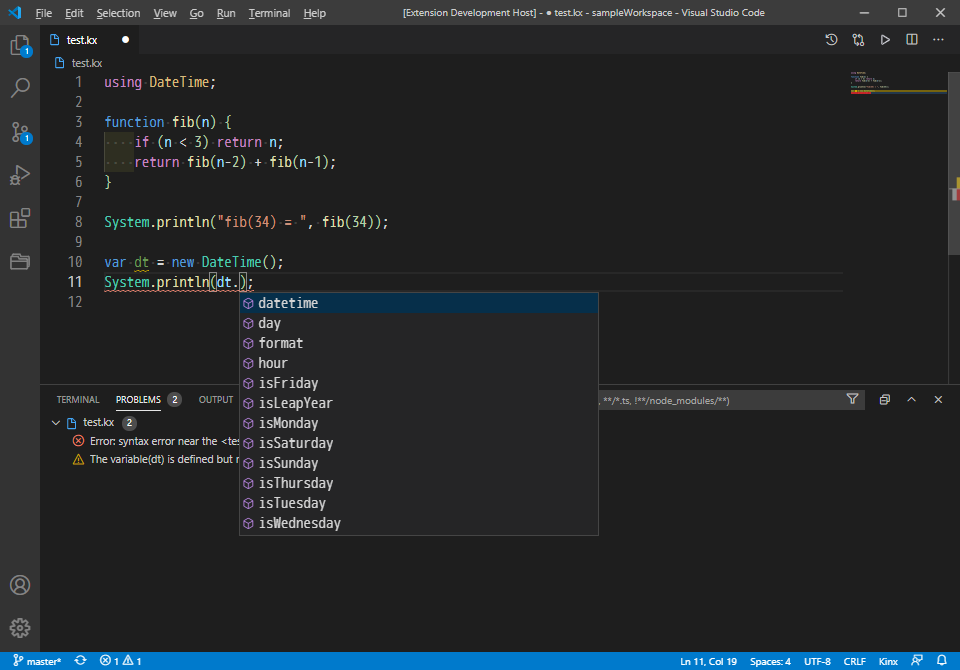

# Kinx VSCode Extension

The Kinx VSCode Extension with Language Server.

# Getting Started

> **Important**
> This extension requires the Kinx version 0.20.1 or above.

Now this product is under construction. It works with a debug mode only.

1. Install Kinx.
2. Add the path of Kinx to the PATH environment variable.
3. Run VSCode under `kinx-language-server` directory.
4. Press <kbd>F5</kbd> key to run it with a debug mode.
5. Load your Kinx source code.

# Features

* Highlight a source code.
* Detects a script error.
* Detects an unused variable though it is defined.
* Run the current script file on the VSCode.
* Auto completion.

## Highlight

Your source code will be displayed with a highlight.
It will be suited with your theme color.

## Error

Compile Error will be detected as an error.
You can find and fix it easily.

## Warning

Unused variables are detected as a warning.
It is not an error, but you can check it easily.

## Run Script

You can run your script code on the fly even without saving.
It is easy because of clicking an icon or just pressing a <kbd>Ctrl-R</kbd> key.

There are 2 modes to run the script.

1. Press <kbd>Ctrl-R</kbd> to run the whole script.
2. Press <kbd>Ctrl-Shift-R</kbd> to run the selected script text only.

## Auto Complete

Auto completion is available.
It suggests public methods collected from the class automatically, and it will also include methods on a base class.

# License

This project is licensed under the **MIT License**.
See the [LICENSE](LICENSE) file for details.

